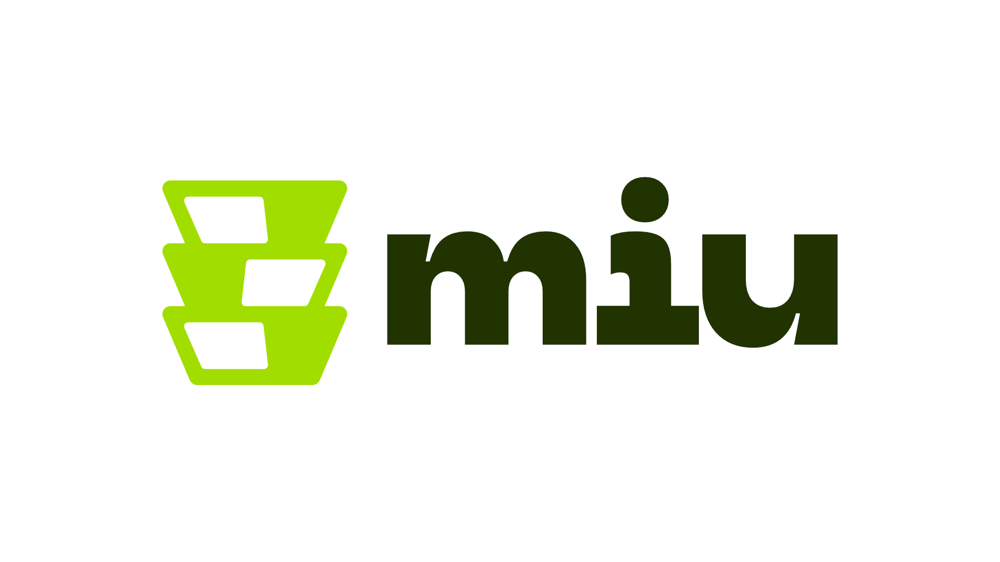

# **Português (Brasil)**

## O problema

Hoje em dia, é relativamente fácil consultar um nutricionista e obter um plano alimentar. Mas e quanto a segui-lo à risca? Muitas pessoas frequentemente encontram desculpas para não cumprir o plano, o que leva a ganhos ou perdas de peso abaixo do esperado. As desculpas mais comuns incluem "Não tenho tempo para cozinhar todos os dias" ou "Preparar as refeições é entediante".

## Público-alvo

Pessoas que querem seguir seu plano alimentar exatamente como foi prescrito de maneira prática, sem se preocupar em cozinhar.

## Proposta de valor

Um aplicativo de delivery altamente interativo, que permite aos usuários preparar suas refeições para a semana inteira, escolhendo cada componente de suas refeições a partir de um cardápio semanal e personalizando cada porção.

## Arquitetura do Software

**[Clique aqui para visitar o nosso Miro!](https://miro.com/app/board/uXjVKTk2aF0=/?share_link_id=943395582634)**

## Group

-   Pedro Victor Gonçalves
-   Luis Felipe Rodrigues
-   Pedro Henrique Sardá

# **English**

## The problem

Today, it's fairly easy to visit a nutritionist and get a meal plan. But what about following it to the letter? People often make excuses for not sticking to the plan, leading to suboptimal weight gain or loss. Common excuses include "I don't have time to cook every day" or "Meal prep is boring".

## Target Audience

People who want to follow their meal plan exactly as prescribed without worrying about cooking.

## Value Proposition

A highly interactive delivery service app that allows users to meal prep their entire week, selecting every component of their desired meals from a weekly menu and customizing each portion.

## Software Architecture

**[Click here to visit our Miro Board!](https://miro.com/app/board/uXjVKTk2aF0=/?share_link_id=943395582634)**

## Group

-   Pedro Victor Gonçalves
-   Luis Felipe Rodrigues
-   Pedro Henrique Sardá
